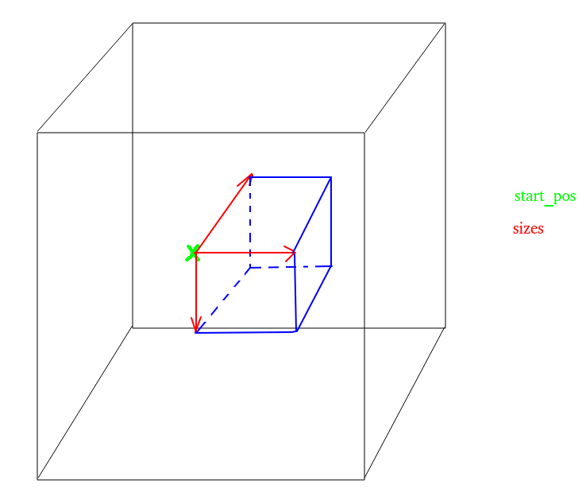

# valarray-4d
A 4 dimensional `std::valarray`.
It has also been proven to work very well as a 3D `std::valarray` if you put the first (or last) stride at a size of 1.
The code also includes write and read functions to interface with a format similar to numpy's `np.fromfile(fname)` and `np.tofile(fname)`.

The usage of `std::valarray` is useful as it's similar to Python's `numpy` arrays. But a very similar code can be used for any unidimensional array type, like `std::vector`.
I made this since I needed it and couldn't find a similar version, even in 3D.

#### The getRegion function

The function `getRegion(start_pos, sizes)` selects a 4d region using the following scheme.

The drawing is in 3D, but the function works in 4D. `start_pos` is 4D vector representing the initial position and `sizes` is a 4D vector representing the range in each dimension.

The other functions work in a pretty straight-forward manner according to their names 
